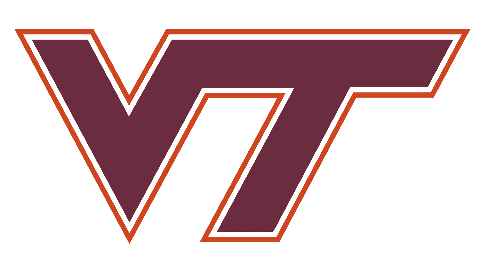
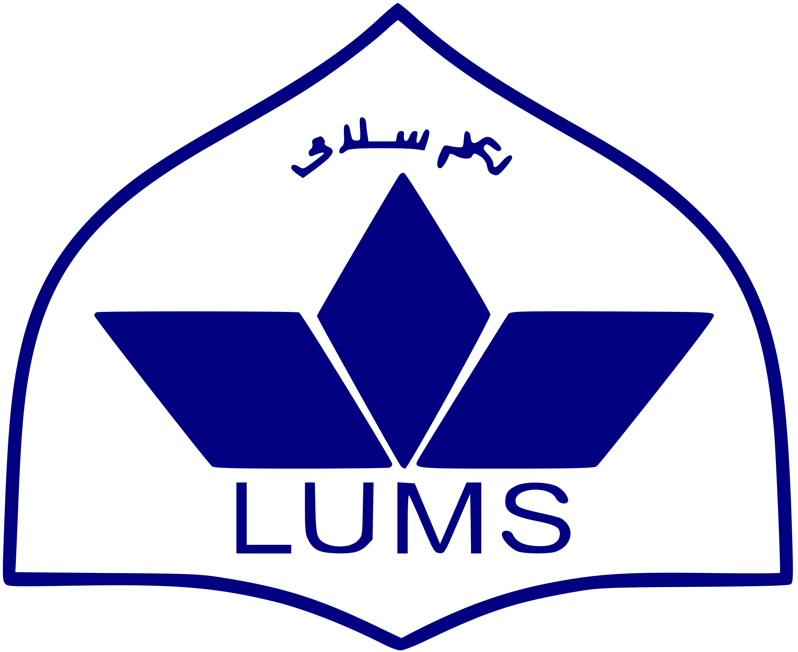
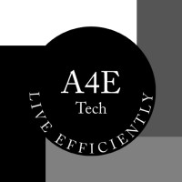
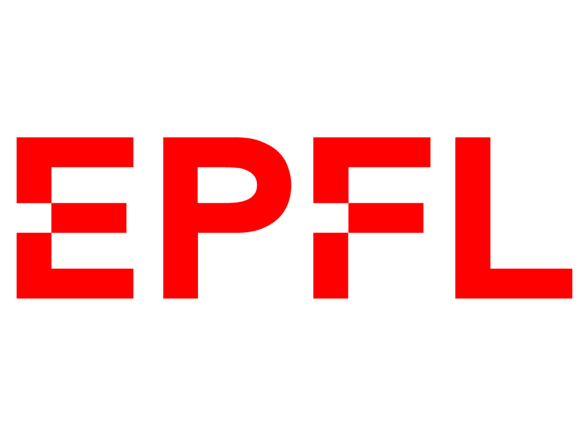

I am an MS Computer Science student in the Data Security and Privacy Lab (DSPL) at [Virginia Tech](https://cs.vt.edu/), advised by [Dr. Murat Kantarcioglu](https://www.kantarcioglu.net/), and a member of the [Sanghani Center for Artificial Intelligence & Data Analytics](https://sanghani.cs.vt.edu/people/students/mughees-ur-rehman.html).

Prior to this, I completed my BS CS from [Lahore University of Management Sciences (LUMS)](https://lums.edu.pk/), where I was part of the [Networks and Systems Group](https://nsg.lums.edu.pk/), working under the supervision of [Dr. Zafar Ayyub Qazi](https://web.lums.edu.pk/~zafar/).

My research spans AI security, networked systems, and Internet measurements. I focus on the intersection of networking and security, with the goal of enhancing the accuracy and robustness of network intrusion-detection systems.

<strong style="color: red;">Updates:</strong> I'm on the job market, actively seeking roles starting May 2026.
 

## Education

  
  
    <strong>Virginia Tech</strong>, Blacksburg, Virginia 
    MS in Computer Science (2024 - Present)  
    Advisor: Murat Kantarcioglu  
    CGPA: 4.00/4.00 
  

 

  
  
    <strong>LUMS (Lahore University of Management Sciences)</strong>, Lahore, Pakistan 
    BS in Computer Science (2020 - 2024)  
    Advisor: Zafar Ayyub Qazi  
    CGPA: 3.97/4.00 
  

 

## Publications

* [Edge Caching as Differentiation](https://dl.acm.org/doi/10.1145/3718958.3754350).  
Muhammad Abdullah, **Mughees Ur Rehman**, Pavlos Nikolopoulos, Katerina Argyraki\
<strong style="color: red;">ACM SIGCOMM 2025</strong> (acceptance rate: 16%) —
<strong style="color: green;">
  
  Best Student Paper Award
</strong>

## Academic Service {#service}
* [ACM SIGCOMM 2025](https://conferences.sigcomm.org/sigcomm/2025/cf-artifacts/) (Artifacts Evaluation Committee Member)

## Teaching {#teaching}
* CS 5740: AI Tools for Software Engineering (Fall 2024 & 2025, Virginia Tech)
* CS 3114: Data Structures and Algorithms (Spring 2025, Virginia Tech)
* CS 473 Network Security (Spring 2024, LUMS)
* CS 582 Distributed Systems & CS 535 Machine Learning (Fall 2024, LUMS)
* CS 100 Computational Problem Solving & CS 210 Discrete Mathematics (Fall 2023, LUMS)

## Experience

  
  
    <strong>Analytics 4 Everyone</strong> (June 2025 - August 2025), USA  
    Software Engineering Intern  
    Software Engineer Team 
  

 

  
  
    <strong>EPFL</strong> (May 2024 - August 2024), Switzerland  
    Research Intern 
    Network Architecture Lab (NAL) 
  

 

  
  
    <strong>Educative</strong>, Pakistan (June 2023 - August 2023) 
    Technical Content Engineer
     Answers Team
  

 

## Awards & Honors

* SIGCOMM 2025 [Best Student Paper Award](https://conferences.sigcomm.org/sigcomm/2025/program/papers-info/) (September 2025)
* Tapia Conference 2025 Scholar held at Dallas, Texas (September 2025)
* One of the 80 students selected globally for EPFL's Summer Internship (acceptance rate: 1.3%) (Summer 2024)
* Dean's Honors List Award, LUMS (2020 - 2024)

